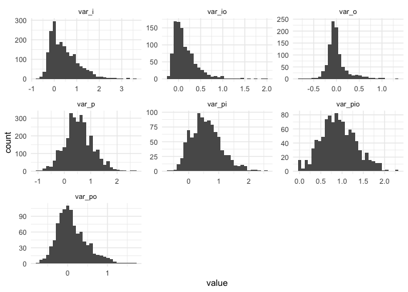

## R Package for Generalizability Theory

The Gboot package implements bootstrap sampling schemes as described in
Tong & Brennan (2004). Two functions, `CalcGTheoryCI` and
`CalcGTheoryCINested` produce bootstrapped confidence intervals for
crossed and nested designs, respectively. Each function can implement
any combination of person, item, and observer (what Tong & Brennan call
person, item, rater).

Within Gboot, you can also simulate data for crossed or nested designs
with `sim_dat_2crossed` and `sim_dat_2nested`.

## Installation

As of now, Gboot is only on GitHub. You can install it with the
following:

``` r
remotes::install_github("alanhuebner10/Gboot")
```

## Core Functions and Workflow

Producing bootstrapped confidence intervals for a *p x i* crossed design
can be done as follows:

``` r
library(Gboot)

data("Brennan.3.1")

bootstrappedCI <- CalcGTheoryCI(Data = Brennan.3.1, B = 1000, type = "pi")

summaryCI(bootstrappedCI)
```

    $Gstudy_Estimates
               Mean   S.E.
    p_Var    0.5870 0.5498
    i_Var    0.4183 0.6073
    o_Var    0.0119 0.2432
    pi_Var   0.5635 0.4903
    po_Var   0.1082 0.4115
    io_Var   0.1621 0.2954
    ResidVar 0.9296 0.4156
    
    $Gstudy_Intervals
       p_Var               i_Var              o_Var              
    CI "(-0.0928, 1.3167)" "(-0.2294, 1.206)" "(-0.2081, 0.3023)"
       pi_Var              po_Var              io_Var             
    CI "(-0.0145, 1.2059)" "(-0.3147, 0.6354)" "(-0.1034, 0.5383)"
       ResidVar          
    CI "(0.4216, 1.4976)"
    
    $Dstudy_Estimates
          AbsErrVar GenCoef DepCoef AbsErrVar_SE GenCoef_SE DepCoef_SE
    value     0.442  0.8516  0.4415       0.3312    10.6024     2.0742
    
    $Dstudy_Intervals
       AbsErrVar_SE       GenCoef_SE          DepCoef_SE         
    CI "(0.0778, 0.8792)" "(-0.0536, 0.9535)" "(-0.1543, 0.9224)"

``` r
bootViz(bootstrappedCI)
```

<!-- -->

Or with simulated data:

``` r
simData <- sim_dat_2crossed(np = 100, ni = 20, nr = 2,
                            sig_p = 4, sig_i =  2, sig_r = 1,
                            sig_pi = 8, sig_pr = sqrt(2), sig_ir = sqrt(3), 
                            sig_pir = 12)

simulatedBootstrappedCI <- CalcGTheoryCI(Data = simData, B = 1000, type = "pi")

summaryCI(simulatedBootstrappedCI)
```

    $Gstudy_Estimates
                 Mean   S.E.
    p_Var     18.2754 5.3897
    i_Var      2.1027 2.2445
    o_Var     -0.1559 0.5640
    pi_Var    56.5959 7.6776
    po_Var     0.8240 3.7022
    io_Var     2.5123 2.0514
    ResidVar 141.7370 8.3971
    
    $Gstudy_Intervals
       p_Var               i_Var               o_Var             
    CI "(11.5899, 25.529)" "(-0.4985, 4.9002)" "(-0.654, 0.5136)"
       pi_Var               po_Var              io_Var            
    CI "(47.1751, 66.0684)" "(-3.5986, 5.5269)" "(0.1377, 5.1799)"
       ResidVar            
    CI "(130.59, 152.1074)"
    
    $Dstudy_Estimates
          AbsErrVar GenCoef DepCoef AbsErrVar_SE GenCoef_SE DepCoef_SE
    value    6.8752  0.7203  0.7177       1.8253     0.0812     0.0819
    
    $Dstudy_Intervals
       AbsErrVar_SE       GenCoef_SE         DepCoef_SE        
    CI "(4.6717, 9.2751)" "(0.6188, 0.8139)" "(0.6177, 0.8135)"

``` r
bootViz(simulatedBootstrappedCI)
```

<!-- -->
