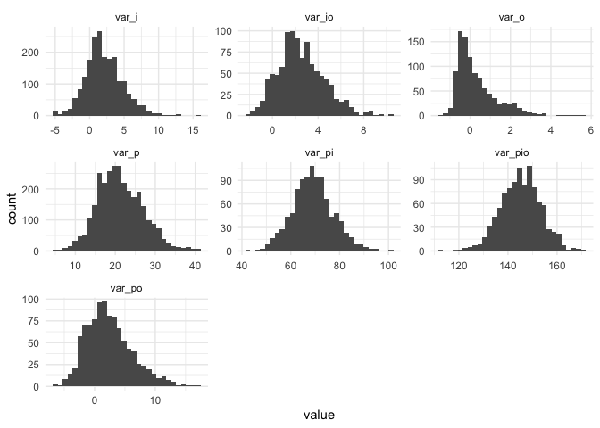

## R Package for Generalizability Theory

The Gboot package implements bootstrap sampling schemes as described in
Tong & Brennan (2004). Two functions, `CalcGTheoryCI` and
`CalcGTheoryCINested` produce bootstrapped confidence intervals for
crossed and nested designs, respectively. Each function can implement
any combination of person, item, and observer (what Tong & Brennan call
person, item, rater).

Within Gboot, you can also simulate data for crossed or nested designs
with `sim_dat_2crossed` and `sim_dat_2nested`.

## Installation

As of now, Gboot is only on GitHub. You can install it with the
following:

``` r
remotes::install_github("alanhuebner10/Gboot")
```

## Core Functions and Workflow

Producing bootstrapped confidence intervals for a *p x i* crossed design
can be done as follows:

``` r
library(Gboot)

data("Brennan.3.1")

bootstrappedCI <- CalcGTheoryCI(Data = Brennan.3.1, B = 1000, type = "pi")

summaryCI(bootstrappedCI)
```

    $Gstudy_Estimates
               Mean   S.E.
    p_Var    0.5468 0.5325
    i_Var    0.4404 0.6337
    o_Var    0.0031 0.2242
    pi_Var   0.5882 0.5113
    po_Var   0.1102 0.3874
    io_Var   0.1530 0.2841
    ResidVar 0.9162 0.4138
    
    $Gstudy_Intervals
       p_Var              i_Var              o_Var              
    CI "(-0.1338, 1.235)" "(-0.207, 1.3465)" "(-0.1963, 0.2571)"
       pi_Var              po_Var              io_Var             ResidVar         
    CI "(-0.0335, 1.2654)" "(-0.3194, 0.6176)" "(-0.105, 0.4938)" "(0.4032, 1.465)"
    
    $Dstudy_Estimates
          AbsErrVar GenCoef DepCoef AbsErrVar_SE GenCoef_SE DepCoef_SE
    value    0.4474  0.9152  0.4814        0.323     7.2952     3.1284
    
    $Dstudy_Intervals
       AbsErrVar_SE       GenCoef_SE          DepCoef_SE         
    CI "(0.0846, 0.8903)" "(-0.1268, 0.9585)" "(-0.2309, 0.9193)"

``` r
bootViz(bootstrappedCI)
```

<!-- -->

Or with simulated data:

``` r
simData <- sim_dat_2crossed(np = 100, ni = 20, nr = 2,
                            sig_p = 4, sig_i =  2, sig_r = 1,
                            sig_pi = 8, sig_pr = sqrt(2), sig_ir = sqrt(3), 
                            sig_pir = 12)

simulatedBootstrappedCI <- CalcGTheoryCI(Data = simData, B = 1000, type = "pi")

summaryCI(simulatedBootstrappedCI)
```

    $Gstudy_Estimates
                 Mean   S.E.
    p_Var     21.2289 5.6989
    i_Var      2.1320 2.6999
    o_Var      0.3037 1.0269
    pi_Var    69.0688 8.4590
    po_Var     2.3896 3.8166
    io_Var     2.5178 2.0322
    ResidVar 145.3173 8.2719
    
    $Gstudy_Intervals
       p_Var                i_Var               o_Var              
    CI "(14.3835, 28.9508)" "(-1.0411, 5.5829)" "(-0.6277, 1.7862)"
       pi_Var             po_Var              io_Var             
    CI "(58.573, 80.026)" "(-2.0964, 7.5804)" "(-0.0223, 5.1866)"
       ResidVar             
    CI "(134.876, 155.4345)"
    
    $Dstudy_Estimates
          AbsErrVar GenCoef DepCoef AbsErrVar_SE GenCoef_SE DepCoef_SE
    value    8.6026  0.7106  0.7029       1.8948     0.0819     0.0812
    
    $Dstudy_Intervals
       AbsErrVar_SE        GenCoef_SE         DepCoef_SE        
    CI "(6.3512, 11.1382)" "(0.6063, 0.8042)" "(0.6027, 0.7952)"

``` r
bootViz(simulatedBootstrappedCI)
```

<!-- -->

You can also use our shiny app to explore simulated results:

``` r
runShinySimulation()
```
